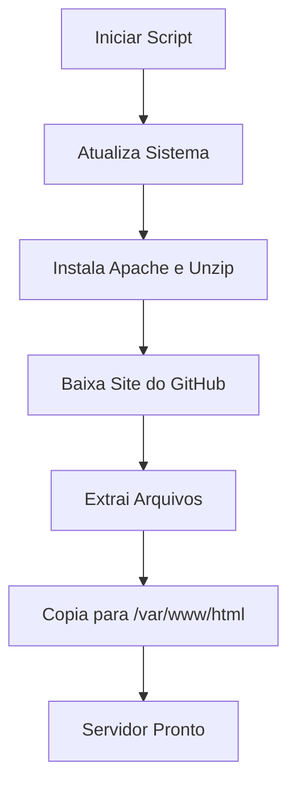

# 📁 Instalação Automática de Servidor Web Apache

Este projeto traz um **script Bash** que automatiza a instalação do servidor **Apache** em um sistema Linux, faz o download de um site de demonstração e o publica automaticamente.

---

## 🛠️ O que o script faz

1. **Atualiza o sistema**:
   - Executa `apt-get update` e `apt-get upgrade`.

2. **Instala o Apache2 e o Unzip**:
   - Instalação automática dos pacotes necessários.

3. **Baixa e publica o site**:
   - Acessa o diretório `/temp`.
   - Baixa um site de demonstração do GitHub.
   - Extrai o conteúdo.
   - Copia os arquivos para `/var/www/html` (página pública do Apache).

---

## 🧩 Fluxo Gráfico



*Obs.: O fluxo mostra a sequência automática de tarefas.*

---

## 🚀 Como executar

1. Clone o repositório:
   ```bash
   git clone https://github.com/WillAcris/Linux-IAC2.git
   ```

2. Dê permissão de execução para o script:
   ```bash
   chmod +x Linux-IAC2.sh
   ```

3. Execute como root (ou com sudo):
   ```bash
   sudo ./Linux-IAC2.sh
   ```

---
